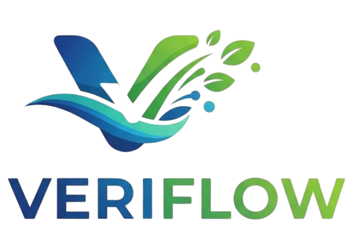
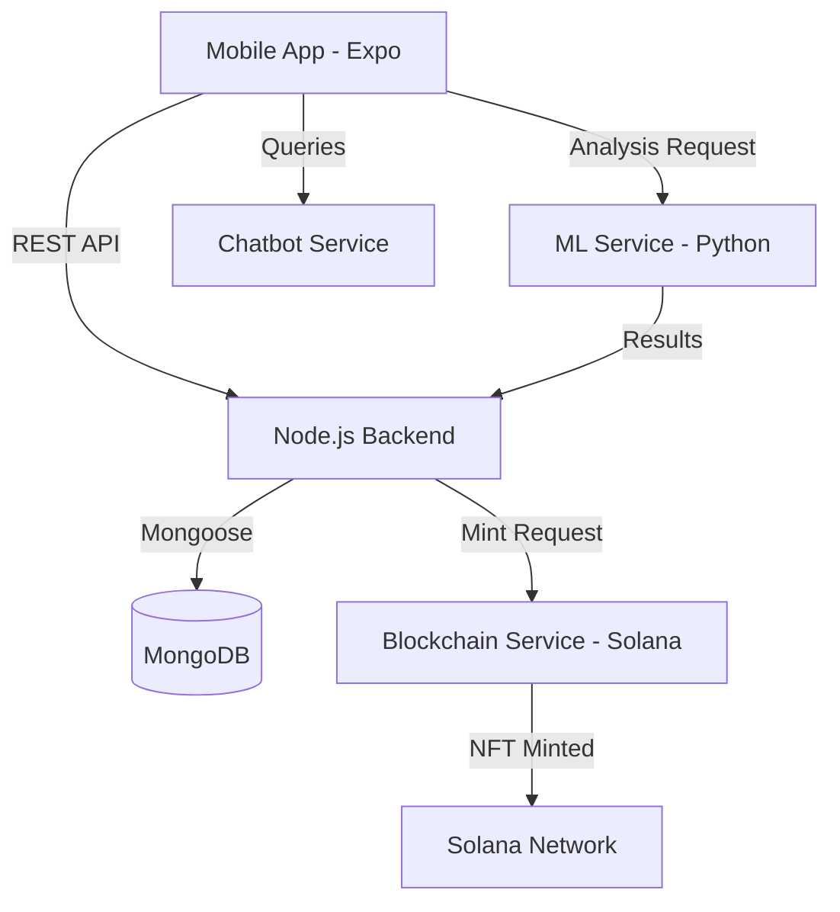

#  Veriflow: Blockchain-Based MRV Platform

[](https://solana.com/)
[](https://reactnative.dev/)
[](https://nodejs.org/)
[](https://www.python.org/)
[](https://www.mongodb.com/)

**Veriflow** is a cutting-edge **Measurement, Reporting, and Verification (MRV)** platform designed to revolutionize carbon sequestration projects. By combining **Satellite/Drone Imagery ML analysis** with **Solana Blockchain technology**, Veriflow ensures transparency, accuracy, and trust in the carbon credit market.

---

## 🌟 Key Features

- 🛰️ **AI-Powered Analysis**: Dual-stage ML pipeline (Satellite + Drone) for precise biomass and carbon sequestration calculation.
- ⛓️ **Blockchain Integrity**: Automated minting of Carbon Credit NFTs on Solana upon successful verification.
- 📱 **Multi-Role Mobile App**: Seamless workflows for Farmers (Plot Registration), Field Operators (Verification), and Admins (Approval).
- 🗺️ **Geospatial Tracking**: Precise plot mapping and satellite imagery integration.
- 🤖 **Intelligent Assistance**: Built-in AI Chatbot for instant support on MRV protocols and platform usage.
- 📑 **Transparent Reporting**: Detailed carbon reports with historical data and confidence scores.

---

## 🏗️ System Architecture

Veriflow is built as a microservices ecosystem to ensure scalability and reliability.



---

## 🛠️ Tech Stack

### Frontend & Mobile
- **React Native / Expo**: Cross-platform mobile experience.
- **Axios**: Robust API communication.
- **React Navigation**: Intuitive user flow.

### Backend & API
- **Node.js / Express**: High-performance API gateway.
- **MongoDB**: Flexible document-based data storage.
- **JWT**: Secure authentication and role-based access control.

### AI & Machine Learning
- **Python / FastAPI**: Fast and scalable ML inference.
- **Joblib / Scikit-learn**: Advanced carbon sequestration models.
- **Geospatial Processing**: Handling TIF and satellite imagery.

### Blockchain
- **Solana Web3.js**: Direct interaction with the Solana blockchain.
- **SPL Tokens**: Minting unique, verifiable carbon credits.

---

## 🚀 Getting Started

### Prerequisites
- Node.js (v18+)
- Python 3.9+
- Solana CLI (for local testing)
- Expo Go app on your mobile device

### Installation

1. **Clone the repository**
   ```bash
   git clone https://github.com/Harshydv-me/Veriflow---Blockchain-based-MRV-platform.git
   cd Veriflow---Blockchain-based-MRV-platform
   ```

2. **Setup Backend**
   ```bash
   cd backend
   npm install
   npm start
   ```

3. **Setup ML Service**
   ```bash
   cd ../ml_service
   pip install -r requirements.txt
   python app.py
   ```

4. **Start the Mobile App**
   ```bash
   cd ../veriflow_app
   npm install
   npx expo start
   ```

---

## 📱 Project Structure

```bash
├── backend/            # Express.js API & Business Logic
├── blockchain/         # Solana integration & Minting scripts
├── ml_service/         # Python ML models & Geospatial API
├── chatbot_service/    # AI Assistant service
└── veriflow_app/       # React Native mobile application
```

---

## 👥 Contributors

- **Harsh Yadav** - *Lead Developer* - [@Harshydv-me](https://github.com/Harshydv-me)
- **Tamanna Nathani** - *Lead Developer* - [@tamannanathani](https://github.com/tamannanathani)

---

## 📄 License

This project is licensed under the MIT License - see the [LICENSE](LICENSE) file for details.

---

<p align="center">
  Built with ❤️ for a Greener Future 🌍
</p>
